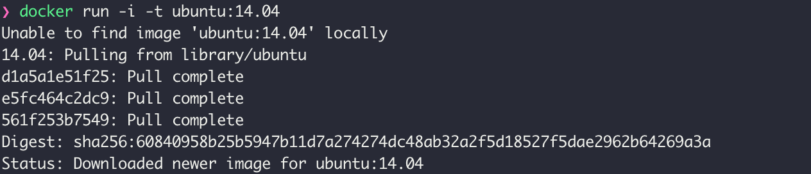

# 도커 / 쿠버네티스 스터디

## Chapter02 도커 엔진

### 2.2 도커 컨테이너 다루기

- 2.2.1 컨테이너 생성
    
    ```bash
    $ docker -v # 도커 버젼 확인
    $ docker run -i -t ubuntu:14.04 # 컨테이너를 생성 및 실행과 동시에 컨테이너 내부로 들어옴
    # -i -t 옵션은 같이 쓰이는 경우가 많다.
    # -i: 상호 입출력
    # -t: tty를 활성화
    # tty : 리눅스 디바이스 드라이브중에서 콘솔이나 터미널을 의미
    # 이 두 옵션은 컨테이너를 종료하지 않은채로, 터미널의 입력을 계속해서 컨테이너로 전달하기 위해서 사용
    # -it 옵션은 특히 컨테이너의 쉘이나 CLI도구를 사용할 때 매우 유용하게 사용됩니다.
    # run 명령어 : docker pull -> create -> start => attach (-it 옵션이 존재할때)
    ```
    
    > 도커 이미지 자동으로 다운로드
    > 
    
    
    
    > 컨테이너 내부
    > 
    
    
    
    exit는 컨테이너를 정지시키고 빠져나온다.
    
    > 도커 이미지 내려받기
    > 
    
    ```bash
    $ docker pull centos:7
    ```
    
    
    
    > 도커 이미지 목록
    > 
    
    ```bash
    $ docker images
    ```
    
    
    
    > 컨테이너 생성
    > 
    
    ```bash
    $ docker create -i -t --name mycentos centos:7
    # create 명령어의 결과로 출력된 무작위의 16진수 해시값은 컨테이너의 고유 ID (너무 길어 앞의 12자리만 사용)
    ```
    
    
    
    `docker inspect 명령어로 컨테이너의 ID를 다시 확인할 수 있다`
    
    
    
    format이 왜 잘리는지는 모름....
    
    > 컨테이너 시작 및 내부로 들어가는 명령어
    > 
    
    ```bash
    $ docker start mycentos
    $ docker attach mycentos
    ```
    
    
    
    Ctrl + P,Q를 입력해 컨테이너를 종료시키지 않고 빠져나옴
    
    
    
    ID값을 입력해 시작 및 접속 가능(ID 생략 가능) 
    
    | exec | attach |
    | --- | --- |
    | docker exec -it [container_name] /bin/bash | docker attach [container_name 또는 container_ID] |
    | 외부에서 컨테이너 진입할 때 사용한다. | container 실행시 사용한다. |
    | 실행시킨 명령어는 컨테이너의 기본 프로세스가 실행되는 동안에만 실행되며 컨테이너를 다시 시작해도 다시 시작되지 않는다. (일시적 영향) | attach로 컨테이너를 접속한다면 처음 도커 컨테이너를 run하였을 때의 환경이 포그라운드로 보여지게 된다. |
- 2.2.2 컨테이너 목록 확인
    
    ```bash
    $ docker ps
    # 정지되지 않은 컨테이너만 출력
    # 옵션
    # -a : 정지된 컨테이너를 포함한 모든 컨테이너 출력 
    # --no-trunc : 전체 Command 보기
    # --format or -f : 필터링 ex) -f "name=mycentos"
    # --last or -n : 마지막에 생성한 컨테이너를 숫자를 정하여 추출할 수 있다. (--latest로 마지막에 안든 컨테이너 확인 가능)
    # --size or -s : 사이즈 표기
    # -q : 컨테이너의 ID만 출력
    ```
    
    
    
    COMMAND : 컨테이너가 시작될 때 명령어
    
- 2.2.3 컨테이너 삭제
    
    ```bash
    $ docker rm centos
    # 실행중인 컨테이너 삭제 방법 : -f 옵션 추가
    # 모든 컨테이너 삭제하는 명령어
    $ docker container prune 
    $ docker stop $(docker ps -a -q)
    $ docker rm $(docker ps -a -q)
    ```
    
    
    
- 2.2.4 컨테이너를 외부에 노출
    - 컨테이너는 가상 머신과 마찬가지로 가상 IP 주소를 할당받는다.
        - 순차적으로 127.17.0.x의 ip 할당
    
    ```bash
    $ docker -it --name network_test ubuntu:14.04
    ```
    
    
    
    아무런 설정을 하지 않았다면 외부에서 접근할 수 없으며 도커가 설치된 호스트에서만 접근할 수 있다.
    
    외부에 컨테이너의 애플리케이션을 노출하기 위해서는 eth0의 ip와 포트를 호스트의 ip와 포트에 바인딩해야 한다.
    
    ```bash
    $ docker run -it --name mywebserver -p 80:80 ubuntu:14.04
    # -p <Host의 포트번호>:<컨테이너의 포트번호>
    ```
    
    
    
    
    
    아파치 웹서버 설치
    
    
    
    실제로 아파치 서버가 설치된 것은 컨테이너 내부이므로 호스트에는 어떠한 영향도 주지 않는다.
    
    `호스트 IP의 80번 포트로 접근 → 80번 포트는 컨테이너의 80번 포트로 포워딩 → 웹서버 접근`
    
- 2.2.5 컨테이너 애플리케이션 구축
    
    `여러개의 애플리케이션을 한 컨테이너에 설치할 수 있지만 컨테이너에 애플리케이션을 하나만 동작시키면 컨테이너 간의 독립성을 보장함과 동시에 애플리케이션 버전 관리, 소스코드 모듈화 등이 더욱 쉬워진다.`
    
    - DB와 워드프레스 웹 서버 컨테이너를 연동해 워드프레스 기반 블로그 서비스 만들기
        
        ```bash
        # mysql 이미지를 사용해 데이터베이스 컨테이너를 생성
        # mysql 이미지는 컨테이너가 시작될 때 mysqld가 동작하도록 설정
        # m1 silicon 이슈...
        $ docker pull --platform linux/amd64 mysql:5.7
        $ docker run -d \
        --platform linux/amd64 \
        --name wordpressdb \
        -e MYSQL_ROOT_PASSWORD=password \
        -e MYSQL_DATABASE=wordpress mysql:5.7
        # 미리 준비된 워드프레스 이미지를 이용해 워드프레스 웹 서버 컨테이너를 생성
        $ docker run -d \
        --platform linux/amd64 \
        -e WORDPRESS_DB_HOST=mysql \
        -e WORDPRESS_DB_USER=root \
        -e WORDPRESS_DB_PASSWORD=password \
        --name wordpress \
        --link wordpressdb:mysql \
        -p 80 wordpress
        
        #사용한 run 명령어 옵션
        # -d : Detached 모드로 컨테이너를 실행 
        ### Detached 모드는 컨테이너를 백그라운드에서 동작하는 애플리케이션으로써 실행하도록 설정
        ### -d 옵션으로 run을 실행하면 입출력이 없는 상태로 컨테이너를 실행
        ### 컨테이너 내부에서 프로그램이 터미널을 차지하는 포그라운드로 실행돼 사용자의 입력을 받지 않는다
        ### Detached 모드인 컨테이너는 반드시 컨테이너에서 프로그램이 실행돼야 하며, 포그라운드 프로그램이 실행되지 않으면 컨테이너는 종료
        
        ```
        
        
        
        호스트의 54647과 연결
        
        ```bash
        # -e : 컨테이너 내부의 환경 변수를 설정
        $ docker exec -i -t wordpressdb /bin/bash
        # exec 명령어를 사용하면 컨테이너 내부에서 명령어를 실행한 뒤 그 결과값을 반환받을 수 있다.
        # 여기서는 -it 옵션을 추가해 /bin/bash를 상호 입출력이 가능한 형태로 exec 명령어를 사용
        ```
        
        
        
        ```bash
        # --link : 내부 IP를 알 필요 없이 항상 컨테이너에 별명(alias)으로 접근하도록 설정
        # --link wordpressdb:mysql
        # 워드프레스 웹 서버 컨테이너는 wordpressdb의 IP를 몰라도 mysql이라는 호스트명으로 접근할 수 있다.
        # 워드프레스 웹 서버 컨테이너에서 mysql이라는 호스트 이름으로 요청을 전송하면 wordpressdb 컨테이너의 내부 IP로 접근하는 것을 확인할 수 있다.
        $ docker exec wordpress curl mysql:3306 --silent
        # 왜 아무것도 안뜨는지 모르겟다...
        # --link 옵션을 사용할 때 유의점
        # --link에 입력된 컨테이너가 실행 중이지 않거나 존재하지 않는다면 --link를적용한 컨테이너 또한 실행할 수 없다는것
        # 현재 deprecated된 옵션이며 추후 삭제될 수 있다.
        # 도커 브리지 네트워크를 사용하면 --link 옵션과 동일한 기능을 더욱 손쉽게 사용할 수 있으므로 **브리지 네트워크를 사용하는 것을 권장**
        ```
        
        
        
- 2.2.6 도커 볼륨
    - 이미 생성된 이미지는 어떠한 경우로도 변경되지 않으며, 컨테이너 계층에 원래 이미지에서 변경된 파일시스템 등을 저장
    - 이미지에 mysql을 실행하는 데 필요한 애플리케이션 파일이 들어있다면 컨테이너 계층에는 워드프레스에서 쓴 로그인 정보나 게시글 등과 같이 데이터베이스를 운용하면서 쌓이는 데이터가 저장
        - 단점
            - mysql 컨테이너를 삭제하면 컨테이너 계층에 저장돼있던 DB의 정보도 삭제됨 (복구 불가)
            - 이를 방지하기 위해 컨테이너의 데이터를 영속적 데이터로 활용할 수 있는 방법 중 가장 활용하기 쉬운 방법이 **볼륨**을 활용하는 것
    - 볼륨을 활용하는 방법
        - 호스트와 볼륨을 공유
            
            ```python
            $ docker run -d \
            --platform linux/amd64 \
            --name wordpressdb_hostvolume \
            -e MYSQL_ROOT_PASSWORD=password \
            -e MYSQL_DATABASE=wordpress \
            -v /Users/ihyeonmin/Desktop/study/docker/wordpress_db:/var/lib/mysql mysql:5.7
            # docker: Error response from daemon: Mounts denied 에러 발생
            # MAC OS의 경우 공유할 호스트의 디렉토리 권한이 File Sharing이 가능하게 설정되어 있어야 한다.
            # Docker Desktop의 preference - Resources - File Sharing 에서 공유할 디렉토리 지정
            $ docker run -d \
            --platform linux/amd64 \
            -e WORDPRESS_DB_PASSWORD=password \
            --name wordpress_hostvolume \
            --link wordpressdb_hostvolume:mysql \
            -p 80 wordpress
            ```
            
            
            
            ```python
            $ docker stop wordpress_hostvolume wordpressdb_hostvolume
            $ docker rm wordpress_hostvolume wordpressdb_hostvolume
            ```
            
            - 호스트에 이미 디렉터리와 파일이 존재하고 컨테이너에도 존재할 때 두 디렉토리를 공유하면?
                
                ```bash
                $ docker run -it --platform linux/amd64 --name volume_dummy alicek106/volume_test
                ```
                
                해당 이미지의 /home 디렉토리에는 testdir_2라는 디렉토리가 존재하고 test라는 파일이 그 안에 들어있다.
                
                
                
                파일 존재
                
                ```bash
                $ docker run -i -t \
                --platform linux/amd64 \
                --name volume_overide \
                -v /Users/ihyeonmin/Desktop/study/docker/wordpress_db:/home/testdir_2 alicek106/volume_test
                # 호스트의 공유 디렉토리 : 컨테이너의 공유 디렉토리
                ```
                
                
                
        - **볼륨 컨테이너 활용 - 보통 이것을 사용한다**
            - -v 옵션으로 볼륨을 사용하는 컨테이너를 다른 컨테이너와 공유하는 것
            - 컨테이너를 생성할 때 --volumes-from 옵션을 설정하면 -v 또는 --volume 옵션을 적용한 컨테이너의 볼륨 디렉토리를 공유할 수 있습니다.
                - 직접 볼륨을 공유하는 것이 아닌 -v 옵션을 적용한 컨테이너를 통해 공유하는 것
            
            ```bash
            # 위에서 생성한 volume_overide 컨테이너에서 볼륨을 공유받음
            $ docker run -it --name volumes_from_container --volumes-from volume_overide ubuntu:14.04
            # 앞에서 생성한 volume_overide 컨테이너는 /home/testdir_2 디렉토리를 호스트와 공유하고 있으며, 이 컨테이너를 볼륨 컨테이너로서 volumes_from_container 컨테이너에 다시 공
            ```
            
            
            
            여러 개의 컨테이너가 동일한 컨테이너에 --volumes-from 옵션을 사용함으로써 볼륨을 공유해 사용 가능
            
            위와 같은 구조를 활용하면 호스트에서 볼륨만 공유하고 별도의 역할을 담당하지 않는 일명 `볼륨 컨테이너` 로서 활용 가능
            
            > 완전히 공유되어서 로컬에서 파일을 수정하면 컨테이너 내에서도 수정이 되어 있는것을 확인 가능
            > 
        - 도커 볼륨
            - 도커 자체에서 제공하는 docker volume 명령어를 활용
            
            ```bash
            $ docker volume create --name myvolume 
            $ docker volume ls
            ```
            
            
            
            ```bash
            $ docker run -it --name myvolume_1 -v myvolume:/root/ ubuntu:14.04 
            # 볼륨을 컨테이너의 /root/ 디렉토리에 마운트 -> /root 디렉토리에 파일을 쓰면 해당 파일이 볼륨에 저장
            # root@3f614440411c:/# echo hello, volume! >> /root/volume
            $ docker run -it --name myvolume_2 -v myvolume:/root/ ubuntu:14.04
            # root@3f614440411c:/# cat /root/volume
            ```
            
            
            
            - 도커 볼륨도 호스트 볼륨 공유와 마찬가지로 호스트에 저장함으로써 데이터를 보존하지만 파일이 실제로 어디에 저장되는지 사용자는 알 필요가 없음
                
                ```bash
                # docker inspect 명령어를 사용해 myvolume 볼륨이 실제로 어디에 저장되는지 알 수 있음
                $ docker inspect --type volume myvolume
                ```
                
                
                
                - 호스트환경에서는 /var/lib/docker/volumes/myvolume/_data가 보이지 않는다.
                    - Mac OS는 docker를 바로 실행시키는 것이 아닌 VM을 띄우고 그 위에 실행시키기 때문
                        - VM 내부에 숨겨져 있다고 생각?
                - docker volume create 명령을 별도로 입력하지 않아도 -v 옵션을 입력할 때 이를 수행하도록 설정할 수 있다.
                    
                    ```bash
                    # 컨테이너에서 공유할 디렉토리의 위치를 -v 옵션에 입력하면 해당 디렉토리에 대한 볼륨을 자동으로 생성
                    $ docker run -it --name volume_auto -v /root ubuntu:14.04
                    ```
                    
                    
                    
                    맨 아래 2번째줄에 생성된 것 확인 가능
                    
                    ```bash
                    $ docker volume prune # 사용되지 않는 볼륨을 한꺼번에 삭제
                    ```
                    
                    
                    
                    - -v 대신 mount 옵션
                        
                        ```bash
                        # -v 옵션 대신 --mount 옵션을 사용할 수도 있다.
                        $ docker run -it --name mount_option_1 --mount type=volume,source=myvolume,target=/root ubuntu:14.04
                        # 호스트의 디렉토리를 컨테이너 내부에 마운트하는 경우 type을 bind로 지정
                        $ docker run -it --name mount_option_2 --mount type=bind,source=/Users/ihyeonmin/Desktop/study/docker/wordpress_db,target=/home/testdir ubuntu:14.04
                        ```
                        
- 2.2.7 도커 네트워크
    - 도커 네트워크 구조
        - 도커는 컨테이너에 내부 IP를 순차적으로 할당하며, 이 IP는 컨테이너을 재시작할 때마다 변경될 수 있다.
        - 도커가 설치된 호스트에서 ifconfig 같은 명령어로 네트워크 인터페이스를 확인하면 실행 중인 컨테이너 수만큼 veth로 시작하는 인터페이스가 생성
            - Mac OS에서는 확인 불가능
        - 컨테이너의 eth0 인터페이스는 호스트의 veth라는 인터페이스와 연결괬으며 veth 인터페이스는 docker0 브리지와 바인딩돼 외부와 통신할 수 있다.
    - 도커 네트워크 기능
        - 컨테이너를 생성하면 기본적으로 docker0 브리지를 통해 외부와 통신할 수 있는 환경을 사용할 수 있지만 사용자의 선택에 따라 여러 너트워크 드라이버를 쓸 수 있다.
        - 도커에서 제공하는 대표적인 네트워크 드라이버
            - Bridge, Host, None, Container, Overlay 등
            
            
            
            - 여기에서의 docker0 bridge : 컨테이너를 생성할 때 자동으로 연결되는 docker0 브리지를 활용하도록 설정
                - 이 네트워크는 172.17.0.x IP 대역을 컨테이너에 순차적으로 할당
                
                
                
                config 항목의 서브넷과 게이트웨이가 172.17.0.0/16과 172.17.0.1로 설정
                
        - 서드파티 플러그인 솔루션 - 더 확장된 네트워크 구성을 위해 활용
            - weave, flannel, openvswitch 등
            - 플러그인들은 EC2또는 Azure 와 같은 도커의 외부 인프라들과의 Integration을 도와주기 때문
        - 브리지 네트워크
            - docker0가 아닌 사용자 정의 브리지를 새로 생성해 각 컨테이너에 연결하는 네트워크 구조
            - 컨테이너는 연결된 브리지를 통해 외부와 통신 가능
            
            ```bash
            # 새로운 브리지 네트워크를 생성
            $ docker network create --driver bridge mybridge
            # mybridge 네트워크를 사용하는 컨테이너 생성
            $ docker run -it --name mynetwork_container --net mybridge ubuntu:14.04
            ```
            
            
            
            - 이렇게 생성된 사용자 정의 네트워크는 docker network disconnect, connect를 통해 컨테이너에 유동적으로 붙이고 뗄 수 있다.
                
                ```bash
                $ docker network disconnect mybridge mynetwork_container
                $ docker network connect mybridge mynetwork_container
                ```
                
                - None 네트워크, Host 네트워크 등과 같은 특별한 네트워크 모드에는 위의 명령어를 사용할 수 없고 bridge 네트워크, overlay 네트워크와 같이 특정 IP 대역을 갖는 네트워크 모드에만 이 명령어를 사용 가능
                - 네트워크의 서브넷, 게이트웨이, IP 할당 범위 등을 임의로 설정하려면 네트워크를 생성할 때 --subnet, --ip-range, --gateway 옵션을 추가
                    - 단, --subnet과 --ip-range는 같은 대역이여야 함
                    
                    ```bash
                    $ docker network create --driver=bridge --subnet=172.72.0.0/16 --ip-range=172.72.0.0/24 --gateway=172.72.0.1 my_custom_network
                    ```
                    
                    
                    
        - 호스트 네트워크
            - 네트워크를 호스트로 설정하면 호스트의 네트워크 환경을 그대로 쓸 수 있고 네트워크를 별도 생성할 필요 없이 기존의 host라는 이름의 network 사용
                
                ```bash
                $ docker run -it --name network_host --net host ubuntu:14.04
                ```
                
                
                
            - 컨테이너의 네트워크를 호스트 모드로 설정하면 컨테이너 내부의 애플리케이션을 별도의 포트 포워딩 없이 바로 서비스할 수 있다.
                
                이는 마치 실제 호스트에서 애플리케이션을 외부에 노출하는 것과 같다
                
        - 논 네트워크
            - none은 말 그대로 아무런 네트워크를 쓰지 않는 것을 뜻한다.
            - 다음과 같이 컨테이너를 생성하면 외부와 연결이 단절된다.
                
                ```bash
                $ docker run -it --name network_none --net none ubuntu:14.04
                ```
                
                
                
        - 컨테이너 네트워크
            - --net 옵션으로 container를 입력하면 다른 컨테이너의 네트워크 네임스페이스 환경을 공유할 수 있다.
                - 공유되는 속성
                    - 내부 IP
                    - 네트워크 인터페이스의 맥 주소
                - --net 옵션의 값으로 container:[다른 컨테이너의 ID] 와 같이 입력합니다.
                
                ```bash
                $ docker run -it -d --name network_container_1 ubuntu:14.04
                $ docker run -it -d --name network_container_2 --net container:network_container_1 ubuntu:14.04
                $ docker exec network_container_1 ifconfig
                $ docker exec network_container_2 ifconfig
                ```
                
                
                
                두 컨테이너의 eth0에 대한 정보가 완전히 같다
                
        - 브리지 네트워크와 --net-alias
            - 브리지 타입의 네트워크와 run 명령어의 --net-alias 옵션을 함께 쓰면 특정 호스트 이름으로 컨테이너 여러 개에 접근할 수 있다.
            - 위에서 생성한 mybridge 네트워크를 이용해 컨테이너 3개 생성
                
                ```bash
                $ docker run -it -d --name network_alias_container1 --net mybridge --net-alias alicek106 ubuntu:14.04
                $ docker run -it -d --name network_alias_container2 --net mybridge --net-alias alicek106 ubuntu:14.04
                $ docker run -it -d --name network_alias_container3 --net mybridge --net-alias alicek106 ubuntu:14.04
                # inspect 명령어로 각 컨테이너의 IP 확인
                $ docker inspect network_alias_container1 | grep IPAddress
                $ docker inspect network_alias_container2 | grep IPAddress
                $ docker inspect network_alias_container3 | grep IPAddress
                ```
                
                
                
                ```bash
                $ docker run -it --name network_alias_ping --net mybridge ubuntu:14.04
                # ping -c 1 alicek106
                ```
                
                
                
                위에서 생성한 3개의 컨테이너로 각각 ping이 전송됨(라운드로빈 방식)
                
                > 이것이 가능한 이유는 도커 엔진에 내장된 DNS가 alicek106이라는 호스트 이름을 --net-alias 옵션으로 alicek106을 설정한 컨테이너로 변환하기 때문!
                > 
                - 도커의 DNS는 호스트 이름으로 유동적인 컨테이너를 찾을 때 주소 사용
                    - --link 옵션
                        - 컨테이너의 IP가 변경돼도 별명으로 컨테이너를 찾을 수 있게 DNS에 의해 자동으로 관리됨 - 디폴트 브리지 네트워크의 컨테이너 DNS라는 점이 다름
                    - --net-alias 옵션
                        - 도커는 기본 브리지 네트워크가 아닌 사용자가 정의한 브리지 네트워크에 사용되는 내장 DNS 서버를 가지며, DNS의 IP는 127.0.0.11
                        - mybridge라는 이름의 네트워크에 속한 3개의 컨테이너는 run으로 생성할 때 --net-alias 옵션에 alicek106이라는 값을 입력했으며,
                            
                            이 컨테이너의 IP는 DNS 서버에 alicek106이라는 호스트 이름으로 등록됨
                            
                        - 반환되는 IP의 리스트 순서가 모두 다름
                            
                            
                            
            - MacVLAN 네트워크
                - 호스트의 네트워크 인터페이스 카드를 가상화해 물리 네트워크 환경을 컨테이너에게 동일하게 제공
                - MacVLAN을 사용하면 컨테이너는 물리 네트워크상에서 가상의 맥(MAC) 주소를 가지며, 해당 네트워크에 연결된 다른 장치와의 통신이 가능
                    - MacVLAN에 연결된 컨테이너는 기본적으로 할당되는 IP 대역인 172.17.X.X 대신 네트워크 장비의 IP를 할당받기 때문
                - MacVLAN을 사용하려면 적어도 1개의 네트워크 장비와 서버가 필요

- 2.2.8 컨테이너 로깅
    - json-file 로그 사용하기
        - 도커는 컨테이너의 표준 출력(StdOut)과 에러(StdErr) 로그를 별도의 메타데이터 파일로 저장하며 이를 확인하는 명령어를 제공
            
            ```bash
            $ docker run -d --name mysql --platform linux/amd64 -e MYSQL_ROOT_PASSWORD=1234 mysql:5.7
            $ docker logs mysql
            ```
            
            
            
            ```bash
            $ docker run -d --name no_passwd_mysql --platform linux/amd64 mysql:5.7
            # no_passwd_mysql 컨테이너는 생성됐으나 실행되지 않았다.
            # 로그를 확인해보면 비밀번호 옵션 관련 오류 발생
            ```
            
            
            
            ```bash
            $ docker ps --format "table {{.ID}}\t{{.Status}}\t{{.Ports}}\t{{.Names}}"
            # ps 포맷
            # 컨테이너 아이디 \t 상태 \t 개방한 포트와 호스트에 연결한 포트 \t 이름
            $ docker start no_passwd_mysql # 컨테이너는 시작되지 않음
            $ docker ps --format "table {{.ID}}\t{{.Status}}\t{{.Ports}}\t{{.Names}}"
            $ docker logs --tail 2 mysql
            $ docker logs -f -t mysql
            ```
            
            
            
            ```bash
            $ docker run -it --log-opt max-size=10k --log-opt max-file=3 --name log-test ubuntu:14.04
            # --log-opt 옵션으로 컨테이너 json 로그 파일의 최대 크기 및 최대 개수를 지정할 수 있다.
            # 로깅 드라이버는 기본적으로 json-file로 설정되지만 도커 데몬 시작 옵션에서 --log-driver 옵션을 써서 변경할 수 있음
            ```
            
    - syslog 로그
        - 컨테이너 로그는 JSON뿐 아니라 syslog로 보내 저장하도록 설정할 수 있다.
        - syslog는 유닉스 계열 운영체제에서 로그를 수집하는 오래된 표준 중 하나로서, 커널, 보안 등 시스템과 관련된 로그, 애플리케이션의 로그 등 다양한 종류의 로그를 수집해 저장
            - 대부분의 유닉스 계열 운영체제에서는 syslog를 사용하는 인터페이스가 동일하기 때문에 체계적으로 로그를 수집하고 분석할 수 있는 장점
                
                ```bash
                $ docker run -d --name syslog_container --log-driver=syslog ubuntu:14.04 echo syslogtest
                ```
                
                
                
                로컬호스트의 syslog에 저장이 되는데, Mac OS 환경에서는 안되어있음
                
                - ubuntu 14.04 /var/log/syslog
                - centos, RHEL /var/log/messages
                - ubuntu 16.04, CoreOS journalctl -u docker.service
        - rsyslog 설정
            - 로컬호스트의 syslog 뿐만 아니라 remote의 syslog도 사용할 수 있습니다.
        - rsyslog 서버 설정
        
        먼저 rsyslog를 위한 서버를 만들도록 하겠습니다.
        
        ```bash
        $ docker run -i -t --name rsyslog_server -h rsyslog -p 514:514 -p 514:514/udp ubuntu:14.04
        # -h : 컨테이너의 호스트네임
        $ vi etc/rsyslog.conf
        # syslog 서버를 구동시키는 항목의 주석을 해제
        ################################
        # provides UDP syslog reception
        $ModLoad imudp
        $UDPServerRun 514
        
        # provides TCP syslog reception
        $ModLoad imtcp                         
        $InputTCPServerRun 514
        ################################
        # rsyslog 서비스 재시작
        $ service rsyslog restart
        ################################
        ```
        
        - rsyslog 클라이언트 설정
            
            ```bash
            # syslog-facility를 쓰면 로그가 저장될 파일을 바꿀 수 있음
            $ docker run -i -t --name rsyslog_client --log-driver=syslog --log-opt syslog-address=tcp://172.17.0.2:514 \
            	--log-opt tag="mylog" --log-opt syslog-facility="mail" ubuntu:14.04
            # mail.log 형식으로 저장
            ```
            
    - fluentd 로깅
        - fluentd : 각종 로그를 수집하고 저장할 수 있는 기능을 제공하는 오픈소스 도구로서, 도커 엔진의 컨테이너의 로그를 fluentd를 통해 저장할 수 있도록 플러그인을 제공
            - 데이터 포맷 : JSON
            - 수집되는 데이터를 aws S3,HDFS,MONGODB 등 다양한 저장소에 저장 가능
        - fluentd와 몽고DB를 연동해 데이터를 저장하는 방법
            
            특정 호스트에 생성되는 컨테이너는 하나의 fluentd에 접근하고, fluentd는 몽고DB에 데이터를 저장하는 구조
            
            ```bash
            # 몽고 DB 컨테이너 생성
            $ docker run --name mongoDB -d -p 27017:27017 mongo
            $ vi fluent.conf
            #########
            <source>
              @type forward
            </source>
            <match docker.**>
              @type file
              database nginx
              collection access
              host 192.168.0.102
              port 27017
              flush_interval 10s
            </match>
            ##########
            # fluentd 컨테이너 생성
            $ docker run -d --name fluentd -p 24224:24224 \
            	-v $(pwd)/fluent.conf:/fluentd/etc/fluent.conf -e FLUENTD_CONF=fluent.conf \
            	alicek106/fluentd:mongo
            # -v 옵션을 이용해 fluentd 컨테이너에 공유하고 설정파일로 사용
            # alicek106/fluentd:mongo 공식 fluentd 이미지에 몽고 DB 플러그인을 설치한 것
            # 로그를 수집할 컨테이너 생성
            $ docker run -p 80:80 -d --log-driver=fluentd --log-opt fluentd-address=192.168.0.101:24224 \
            	--log-opt tag=docker.nginx.webserver nginx
            # 로그의 태그를 docker.nginx.webserver로 지정했지만 fluentd의 설정 파일 중 <match docker.**>에 맞으므로 몽고DB에 로그로서 저장
            # 도커 엔진은 fluentd 서버에 컨테이너의 로그를 전송했고 이 로그는 다시 몽고DB 서버로 전송되어 저장됐다는 점
            ```
            
- 2.2.9 컨테이너 자원 할당 제한
    - 컨테이너를 생성하는 run,create 명령어에서 컨테이너의 자원 할당량을 조정하도록 옵션을 입력할 수 있다
    - 아무런 옵션을 입력하지 않으면 컨테이너는 호스트의 자원을 제한 없이 쓸 수 있게 설정됨
    - 현재 컨테이너에 설정된 자원 제한을 확인하는 가장 쉬운 방법은 docker inspect 명령어를 입력하는 것
        
        
        
    
    ```bash
    # 컨테이너 자원 제한 변경
    $ docker update (변경할 자원 제한) (컨테이너 이름)
    $ docker update --cpuset-cpus=1 centos ubuntu
    # 메모리 제한
    $ docker run -d --memory="1g" --name memory_1g nginx --platform linux/amd64
    $ docker inspect memory_1g | grep \"Memory\"
    # 컨테이너 내에서 동작하는 프로세스가 컨테이너에 할당된 메모리를 초과하면 컨테이너는 자동으로 종료되므로 애플리케이션에 따라 메모리를 적절하게 할당하는 것이 좋다.
    # 메모리를 적게 할당하고 컨테이너를 실행하면 메모리가 부족해 컨테이너가 실행되지 않음
    ```
    
    
    
    ```bash
    # 기본적으로 컨테이너의 Swap 메모리는 메모리의 2배로 설정되지만 별도로 지정할 수 있음
    $ docker run -it --memory=200m --memory-swap=500m ubuntu:14.04
    # --memory : 물리적인 메모리의 크기
    # --memory-swap : 스왑메모리 + 물리메모리의 크기
    ```
    
    > **Swap 메모리** : 메모리 사용량이 늘어남에 따라서 디스크의 일부를 마치 확장된 RAM 처럼 사용할 수 있게 해주는 기술
    > 
    
    > 커널은 실제 메모리에 올라와 있는 메모리 블록들 중에서 당장 쓰이지 않는 것을 디스크에 저장하여, 사용 가능한 메모리 영역을 늘립니다.
    > 
    
    ```bash
    # CPU 제한
    # --cpu-shares 옵션 : 컨테이너에 가중치를 설정해 해당 컨테이너가 CPU를 상대적으로 얼마나 사용할 수 있는지
    # 컨테이너에 CPU를 한 개씩 할땅하는 방식이 아닌, 시스템에 존재하는 CPU를 어느 비중만큼 나눠 쓸 것인지를 명시하는 옵션
    $ docker run -it --name cpu_share --cpu-shares 1024 ubuntu:14.04
    # 1024 -> CPU 할당에서 1의 비중을 뜻함
    $ docker run -d --name cpu_1024 --cpu-shares 1024 alicek106/stress stress --cpu 1
    $ ps aux | grep stress
    
    # --cpuset-cpu
    # 호스트에 CPU가 여러 개 있을 때 --cpuset-cpus 옵션을 지정해 컨테이너가 특정 CPU만 사용하도록 설정할 수 있습니다.
    $ docker run -d --name cpuset_2 --cpuset-cpus=2 alicek106/stress stress --cpu 1
    
    # 컨테이너의 CFS 주기 변경
    # --cpu-period, --cpu-quota
    $ docker run -d --name quota_1_4 --cpu-period=100000 --cpu-quota=25000 alicek106/stress stress --cpu 1
    # --cpu-period=100000 -> 100ms
    # --cpu-quota=25000 : --cpu-period에 설정된 시간 중 CPU 스케줄링에 얼마나 할당할 것인지를 설정
    # 결국 --cpu-period 값 / --cpu-quota 값 만큼 CPU 시간을 할당받음
    # --cpu-period=100000 --cpu-quota=25000 이면 1/4 만큼 할당받음
    # CPU 주기가 1/4로 줄었으므로 일반적인 컨테이너보다 CPU 성능이 1/4 정도로 감소
    
    # CPU 개수 지정
    # --cpus
    # --cpu-period, --cpu-quota, --cpu-share 와 동일한 기능을 하나, 좀 더 직관적으로 CPU 개수를 직접 지정할 수 있음
    # --cpus=0.5 : --cpu-period=100000 또는 --cpu-quota=50000 과 동일하게 컨테이너 CPU를 제한 할 수 있다.
    ```
    
    - Block I/O 제한
        - --device-write-bps: 쓰기 작업 제한 (절대값)
            
            ```bash
            # kb, mb, gb 사용 가능
            # ${디바이스_이름}:${값} 형태
            --device-write-bps /dev/xvda:1mb
            ```
            
        - --device-read-bps: 읽기 작업 제한 (절대값)
        - --device-write-iops: 쓰기 작업 제한 (상대값)
            
            ```bash
            --device-write-iops /dev/xvda:5
            --device-write-iops /device/xvda:10 # 2배 차이가 남
            ```
            
        - --device-read-iops: 읽기 작업 제한 (상대값)
    - 스토리지 드라이버와 컨테이너 저장 공간 제한
        - 도커 엔진은 컨테이너 내부의 저장 공간을 제한하는 기능을 보면 보편적으로 제공하지는 않지만, 도커의 스토리지 드라이버나 파일 시스템 등이 특정 조건을 만족하는 경우에만 이 기능을 사용할 수 있습니다.

### 2.3 도커 이미지

- 모든 컨테이너는 이미지를 기반으로 생성
- 도커는 기본적으로 도커 허브(Docker)라는 중앙 이미지 저장소에서 이미지를 내려받는다
- docker search 명령어로 이미지 검색 가능
- 2.3.1 도커 이미지 생성
    - 컨테이너 안에서 작업한 내용을 이미지로 만드는 방법
        
        ```bash
        # 우선, 이미지로 만들 컨테이너를 생성
        $ docker run -it --name commit_test ubuntu:14.04
        root@48879576ad8c:/# echo test_first! >> first
        # 컨테이너를 이미지로 생성
        $ docker commit -a "dlgusals59" -m "my first commit" commit_test commit_test:first
        # 이미지 이름 : commit_test
        # 태그 : first
        # -a 옵션 : 이미지의 작성자를 나타내는 메타 데이터를 이미지에 포함
        # -m 옵션 : 커밋 메시지
        # 이미지 생성 확인
        $ docker images
        ```
        
        
        
        ```bash
        # 생성한 이미지로 새로운 컨테이너 생성
        $ docker run -it --name commit_test2 commit_test:first
        root@ab412641c633:/# echo test_second! >> second
        $ docker commit -a "dlgusals59" -m "my second commit" commit_test2 commit_test:second
        # 이미지 생성 확인
        $ docker images
        ```
        
        
        
- 2.3.2 이미지 구조 이해
    
    ```bash
    $ docker inspect ubuntu:14.04
    $ docker inspect commit_test:first
    $ docker inspect commit_test:second
    # Layer 항목 확인
    ```
    
    
    
    - commit_test:first : ubuntu 이미지 + first 파일
    - commit_test:second : commit_test:first 이미지 (ubuntu 이미지 + first 파일) + second 파일
    
    ```bash
    # 이미지 삭제
    $ docker rmi commit_test:first
    # Error response from daemon: conflict: unable to remove repository reference "commit_test:first" (must force) - container ab412641c633 is using its referenced image 81d92824ebcc
    # 오류 발생 이유 : 해당 이미지를 사용 중인 컨테이너가 존재하므로 해당 이미지는 삭제 불가
    $ docker stop commit_test2 && docker rm commit_test2
    $ docker rmi commit_test:first
    # Untagged: commit_test:first
    
    # 컨테이너가 사용 중인 이미지를 docker rmi -f로 강제로 삭제하면 이미지의 이름이 <none>으로 변경되며, 이러한 이미지들을 댕글링(dangling) 이미지라고 한다.
    $ docker images -f dangling=true
    # 사용중이지 않는 댕글링 이미지 한꺼번에 삭제
    $ docker image prune
    ```
    
    - commit_test:first 이미지를 삭제했다고 해서 실제로 해당 이미지의 레이어 파일이 삭제되지는 않습니다.
        - 이유 : commit_test:first 이미지를 기반으로 하는 하위 이미지인 commit_test:second가 존재하기 때문
        - rmi 명령어의 출력 결과인 Untagged: 는 이미지에 부여된 이름만 삭제한다는 것을 뜻함
- 2.3.3 이미지 추출
    - 도커 이미지를 별도로 저장하거나 옮기는 등 필요에 따라 이미지를 단일 바이너리 파일로 저장해야 할 때 docker save 명령어를 사용하면 컨테이너의 커맨드, 메타데이터를 포함해 하나의 파일로 추출할 수 있다.
    
    ```bash
    # 이미지 추출
    $ docker save -o ubuntu_14_04.tar ubuntu:14.04
    # -o 옵션 : 추출될 파일명
    # 추출된 이미지 load
    $ docker load -i ubuntu_14.04.tar
    
    # export 명령어 : 컨테이너의 파일 시스템을 tar 파일로 추출하며 컨테이너 및 이미지에 대한 설정 정보를 저장하지 않음
    $ docker export -o rootFS.tar mycontainer
    # import 명령어 : export 명령어로 추출된 파일을 이미지로 다시 저장할 때 사용
    $ docker import rootFS.tar myimage:0.0
    ```
    
    - 이미지를 단일 파일로 저장하는 것은 비효율적
        - 추출된 이미지는 레이어 구조의 파일이 아닌 단일 파일이기 때문에 여러 버젼의 이미지를 추출하면 이미지 용량을 각기 차지하게 된다.
- 2.3.4 이미지 배포
    - save나 export와 같은 방법으로 이미지를 단일 파일로 추출해서 배포할 수도 있지만 이미지 파일의 크기가 너무 크거나 도커 엔진의 수가 많다면 이미지를 파일로 배포하기 어렵다.
    - 이미지 배포 방법
        - 도커 허브 이미지 저장소
            
            ```bash
            $ docker run -it --name commit_container1 ubuntu:14.04
            $ docker commit commit_container1 my-image-name:0.0
            # tag 명령어로 이미지 이름 추가
            $ docker tag my-image-name:0.0 dlgusals59/my-image-name:0.0
            $ docker login
            # 명령어의 출력 결과를 보면 하나의 레이어만 저장소로 전송되고, 나머지 레이어는 ubuntu:14.04 이미지에서 생성되어 도커 허브의 우분투 이미지 저장소에 이미 존재하므로 전송되지 않음
            $ docker push dlgusals59/my-image-name:0.0
            ```
            
            
            
        - 도커 사설 레지스트리
            - 대신, 사용자가 직접 이미지 저장소 및 사용되는 서버,저장 공간 등을 관리해야 함